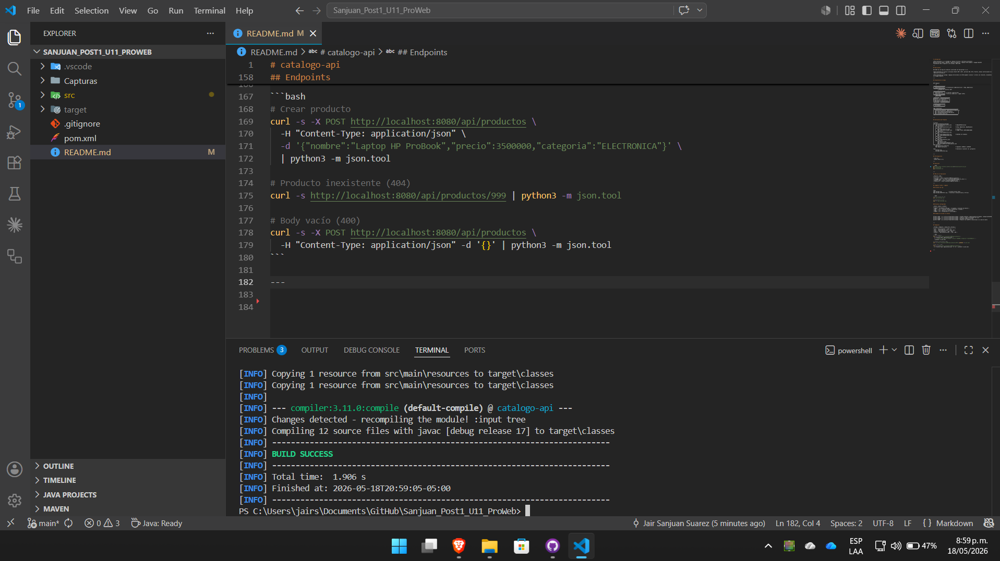
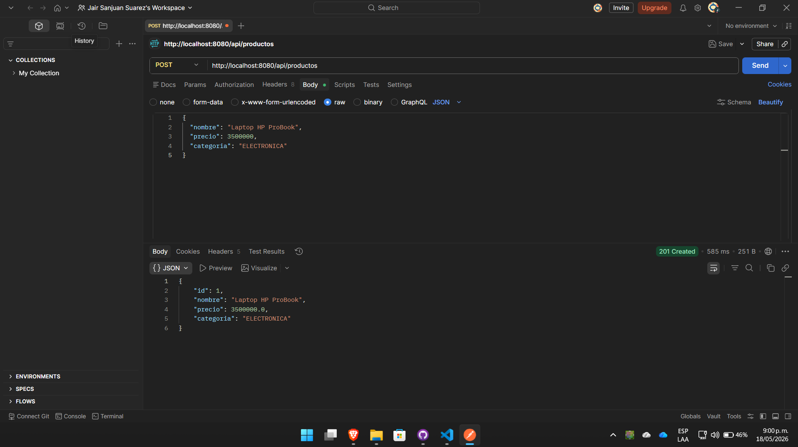
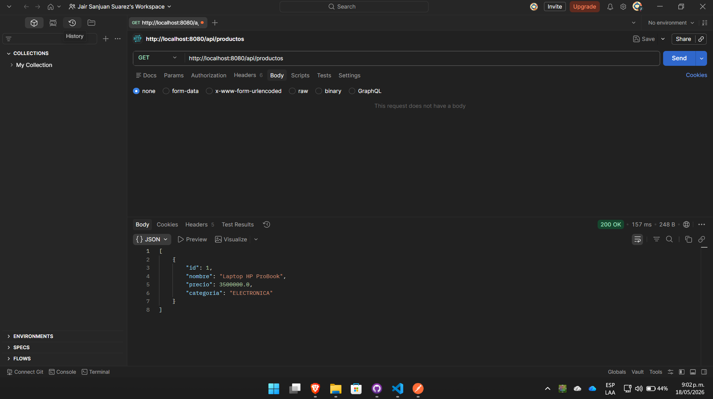

# catalogo-api

**Post-Contenido 1 y 2 — Unidad 11: Buenas Prácticas y Patrones de Diseño**  
Refactorización SOLID + DAO/DTO + @ControllerAdvice + Logging SLF4J/Logback + Swagger/OpenAPI  
Programación Web — Ingeniería de Sistemas, UDES 2026

---

## Descripción

API REST de catálogo de productos construida con Spring Boot 3.2.5.

**Post-Contenido 1** aplica: principios SOLID (SRP y DIP), patrones DAO, DTO y Factory, manejo centralizado de excepciones con `@RestControllerAdvice`.

**Post-Contenido 2** agrega: logging estructurado con SLF4J/Logback (consola + archivo con rotación), documentación interactiva con Swagger/OpenAPI.

---

## Arquitectura en Capas

```
HTTP Request
     │
     ▼
┌─────────────────────┐
│  ProductoController │  ← Presentación (@RestController + @Tag, @Operation)
└────────┬────────────┘
         │ depende de interfaz (DIP)
         ▼
┌─────────────────────┐
│  ProductoService    │  ← Interfaz (abstracción)
│  ProductoServiceImpl│  ← Servicio (@Service + Logger SLF4J)
└────────┬────────────┘
    ┌────┴────┐
    ▼         ▼
┌──────────┐ ┌─────────────────┐
│Producto  │ │ ProductoFactory │
│Repository│ │ toEntity()      │
│ (DAO/JPA)│ │ toResponseDTO() │
└────┬─────┘ └─────────────────┘
     ▼
┌─────────────────────┐
│  H2 Database        │
└─────────────────────┘

Capa Transversal:
┌──────────────────────────────────────────────┐
│  GlobalExceptionHandler (@RestControllerAdvice)│
│  404 → RecursoNoEncontradoException           │
│  400 → MethodArgumentNotValidException        │
│  500 → Exception genérica                     │
└──────────────────────────────────────────────┘
```

---

## Estructura del Proyecto

```
src/main/
├── java/com/empresa/catalogo/
│   ├── CatalogoApiApplication.java        ← @OpenAPIDefinition
│   ├── controller/
│   │   └── ProductoController.java        ← @Tag, @Operation, @ApiResponse
│   ├── service/
│   │   ├── ProductoService.java           ← Interfaz
│   │   └── ProductoServiceImpl.java       ← Logger SLF4J (INFO/DEBUG/WARN)
│   ├── repository/
│   │   └── ProductoRepository.java
│   ├── dto/
│   │   ├── ProductoRequestDTO.java        ← @Schema con ejemplos
│   │   └── ProductoResponseDTO.java
│   ├── entity/
│   │   └── Producto.java
│   ├── factory/
│   │   └── ProductoFactory.java
│   └── exception/
│       ├── ApiError.java
│       ├── GlobalExceptionHandler.java
│       └── RecursoNoEncontradoException.java
└── resources/
    ├── application.properties
    └── logback-spring.xml                 ← Appenders CONSOLA y ARCHIVO

logs/                                      ← Generado al ejecutar (en .gitignore)
    catalogo.log
    catalogo.2026-05-18.log
```

---

## Prerrequisitos

- Java 17+
- Apache Maven 3.9.x

---

## Ejecución

```bash
git clone https://github.com/<tu-usuario>/Sanjuan-post2-u11.git
cd catalogo-api
mvn spring-boot:run
```

---

## URLs de la Aplicación

| Recurso | URL |
|---------|-----|
| API REST | `http://localhost:8080/api/productos` |
| **Swagger UI** | **`http://localhost:8080/swagger-ui.html`** |
| OpenAPI JSON | `http://localhost:8080/api-docs` |
| Consola H2 | `http://localhost:8080/h2-console` |

---

## Logging — SLF4J + Logback

### Archivos de log

```
logs/
├── catalogo.log              ← archivo activo (hoy)
└── catalogo.2026-05-17.log   ← historial (rotación diaria, 30 días)
```

```bash
# Ver el archivo de log
cat logs/catalogo.log

# Seguimiento en vivo
tail -f logs/catalogo.log
```

### Niveles configurados

| Nivel | Quién | Cuándo |
|-------|-------|--------|
| DEBUG | `com.empresa.catalogo` | Búsquedas y consultas de detalle |
| INFO  | raíz | Creación exitosa, eliminación, listados |
| WARN  | raíz | Recurso no encontrado |
| ERROR | raíz | Excepciones no controladas |

### Ejemplo de salida en consola

```
10:30:15 INFO  c.e.c.service.ProductoServiceImpl - Creando producto: nombre=Laptop HP ProBook, categoria=ELECTRONICA
10:30:15 INFO  c.e.c.service.ProductoServiceImpl - Producto creado exitosamente con id=1
10:30:16 DEBUG c.e.c.service.ProductoServiceImpl - Buscando producto con id=1
10:30:17 WARN  c.e.c.service.ProductoServiceImpl - Producto con id=999 no encontrado en la base de datos
```

---

## Endpoints

| Método | Endpoint | Status OK | Errores |
|--------|----------|-----------|---------|
| GET | `/api/productos` | 200 | — |
| GET | `/api/productos/{id}` | 200 | 404 |
| POST | `/api/productos` | 201 | 400 |
| DELETE | `/api/productos/{id}` | 204 | 404 |

```bash
# Crear producto
curl -s -X POST http://localhost:8080/api/productos \
  -H "Content-Type: application/json" \
  -d '{"nombre":"Laptop HP ProBook","precio":3500000,"categoria":"ELECTRONICA"}' \
  | python3 -m json.tool

# Producto inexistente (404)
curl -s http://localhost:8080/api/productos/999 | python3 -m json.tool

# Body vacío (400)
curl -s -X POST http://localhost:8080/api/productos \
  -H "Content-Type: application/json" -d '{}' | python3 -m json.tool
```
## Evidencias






---

